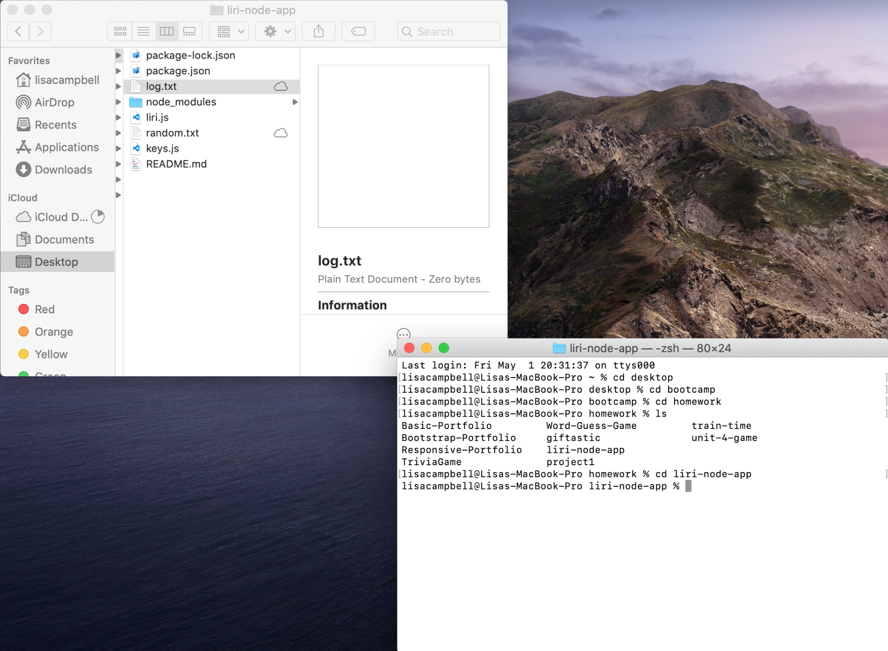
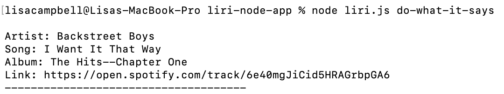
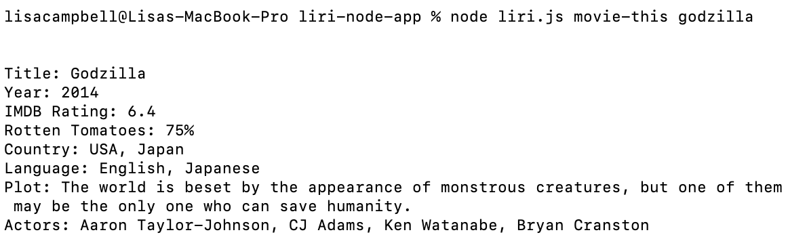
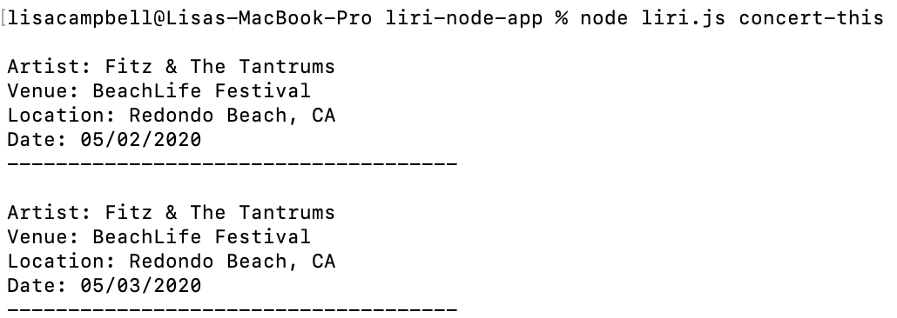
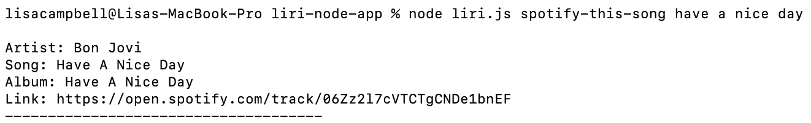

# LIRI Node App
### For Music, Concerts, & Movies
This command line application makes movie, concert, and song data easy to search for in one place.

**All in one convenient app, you can quickly find:**
* Information on any movie, including the ratings, plot blurb, main actors, language, and more.
* Upcoming concert times and locations for your favorite bands.
* Links to previews any song of your choice.

## [Video demo:](https://youtu.be/gm0lsG0yEwc)

If you've ever wanted to tune out the noise of a google search and focus on the basics, you can with LIRI. In one place, get the information you need without clicking through Google pages.

**All you need are these simple commands followed by the specific artist, song name, or movie you want to find:**
* movie-this
* concert-this
* spotify-this-song
* do-what-it-says
    * This last one pulls in the movie, concert, or song data from a separate text file. No additional input needed.

    

## How to use LIRI:
1. Open terminal or bash
2. Navigate to the folder where LIRI is stored on your computer.
3. Type in "node liri [command from above choices] [artist, movie, or song name]" **See example screenshot below**

*Did you know Walter White is in Godzilla? 'Cause I didn't. LIRI is a genius!*

4. Check out what LIRI found! With **movie-this**, you'll get one result, with **concert-this** you'll get as many upcoming concerts as the artist has scheduled, and with **spotify-this-song** you'll get up to five results per song. If you only write a command and no specific artist, movie, or song, we'll surprise you with something we like.

5. For your convenience, LIRI logs a history of all your searches to a file so you can come back later and find all your results in one place.

## Technologies LIRI incorporates:
* Node, including these packages:
    * [axios](https://www.npmjs.com/package/axios): to make HTTP requests, request response data, format JSONs, etc.
    * [fs](https://nodejs.org/api/fs.html): for reading and writing to external files
    * [moment](https://www.npmjs.com/package/moment): puts our concert date into a short, readable format
    * [Node Spotify API](https://www.npmjs.com/package/node-spotify-api): an API library for Spotify
    * Javascript: written by Lisa Campbell

LIRI was conceptualized by Trilogy and developed by Lisa Campbell. Thanks for checking out LIRI and in the words of Bon Jovi, have a nice day!

    
    